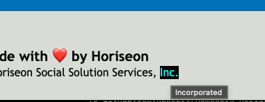

# Horiseon Landing Page Refactored

## Accessability Report

Client requested changes to the website for adherence to modern accessability standards.
Changes have been made to both the HTML file, and the stylesheet to meet these standards.

## View Results

[Live Page on Github](https://rowe2ry.github.io/Homework-HoriseonRefactor/)
[Github repository](https://github.com/Rowe2ry/Homework-HoriseonRefactor)

### Changes to HTML

1. The title in the document's head now describes the company.

2. A comment has been added in the body before the header to aid in code navigation.

3. The header of the page is no longer...
    ```
    <div class="header">
    ```
    but is now...
    ```
    <header class="header>
    ```

4. The navigation bar within the header is no longer a generic div element and is now defined semantically as a nav element by:
    ```
    <nav>
    ```
    
5. A description of the purpose of the nav bas as used on this landing page is outlined as a comment

6. A note has been added to let future developers know that the image can be updated in the stylesheet since the image is not directly linked in the HTML file.

7. An "alt" attribute has been added to the section container that places the background image on the page to serve as the alternate text for the image contained within.

8. A comment has been added to the code for future developers to introduce the next container (\<main>) used in the page as the container with the most important information.

9. The generic div container used to house Horiseon's main products and services has been changed to...
    ```
    <main>
    ```
10. Changed the generic class name of "content" in the main container to a more descriptive "products-and-services" class name.

11. Reworked every (3) child container of the \<main> container to be a \<section> type instead of a generic \<div>.

12. Added an **id attribute** to the first \<section> child of the \<main> container to repair the broken hyperlink in the navbar.

13. Wrapped the string "SEO" in the paragraph of the first \<section> child of the \<main> container with an \<abbr> tag to define the acronym. The acronym is already defined in the page body, but this tag will allow more robust semantic value to the page.

14. Wrapped the string "web" from the paragraph in the 2nd child of the \<main> container in an \<abbr> tag with a title of "The World Wide Web or Internet" to tell users unfamiliar with the term "web" what it is short for.

15. Took note of the 3 children in main having unique classes with identical styling and unified them to one class type "services".

16. Changed the container type of the next large parent container to \<Article> to add semantic value to the container. A comment has also been added to the code to introduce what this section is meant to convey to the end users for future developers.

17. Changed each child container within the \<article class="Benefits"> parent, to a \<section> tag for greater semantic value than a generic div. Also noticed 3 separate classes (1 for each of the 3 children) that had *identical* styling, so these 3 classes were all reassigned to one new class of "single-benefit" and the stylesheet updated to contain **only one** style block.

18. Each "single-benefit" section contains an icon, these icons have been given alt attributes for better accessibility with screen readers.

19. Added a comment to the code for future developers that introduces the footer of the page and what it contains.

20. Changed the last container in the document flow from a generic \<div> container to a \<footer> tag for the semantic value that this is a footer. 

21. Added an \<abbr> tag as well as \<span> tag to the heart emoji to tell sighted users who hover over the heart that this emoji is representing the word "love" and attributes given to the \<span> tag will tell non-sighted users who implement screen readers that an icon here is serving the role of an image that represents "love".

22. Added a valid "YYYY" format \<time> tag to the copywrite information to give semantic value to an otherwise non-contextual "2-0-1-9" string in the footer of the page.

### Changes to CSS

1. Added a table of contents to the top of the stylesheet and reflowed the stylesheet to follow the logical structure outlined in this table of contents.

2. Added block commenting to separate each section of the style sheet. The sections of this style sheet are as follows.
    * **Section 1 —— Standard Page Styling**  
    element selectors that are used throughout the entire page

    * **Section 2 —— Header Styling**  
    all of the style selectors and key-value pairs used specifically in the page's header.

    * **Section 3 —— Hero Image Styling**  
    the style applied to the key photo on the page. It is front and center on the main stage of the user-experience to set the tone for the landing page, so I felt it necessary to give it its own section in the stylesheet. 

    * **Section 4 —— Products and Services Styling**  
    the styling attributes for the main "meat and potatoes" of the site highlighting Horiseon's goods and services they offer to their end users.

    * **Section 5 —— Benefits to User Styling**  
    the styling elements for the aside section of the page which tells Horiseon's users what they stand to gain by using Horiseon's services.

    * **Section 6 —— Footer Styling**  
    the styling rules applied to the footer of the page.
3. Reduced reduntant code by observing 2 instances where 3 classes each had completely *identical* style rules. Consolodated the 3 classes into one in both instances to reduce 6 blocks of code in the style sheet into 2.  


4. Added "hover" and "focus-visible" state styles to the anchors containing hyperlinks so that users would have some feedback when interacting with the site that they are hovering over, (or have focus of) hyperlinks.  


5. Added styling to the \<abbr> tags that were newly added to the main HTML code to avoid the default browser styling of these elements from deviating from the company brand guide aesthetic. Changed the "hover" state styling so that users would be encouraged to stop and inspect elements to discover the abbreviation definitions.  


6. Updated all div references in the stylesheet to the appropriately updated container names that have semantic value.

7. Truncated redundant parent-child relationship selectors that end up targeting a single class anyway.